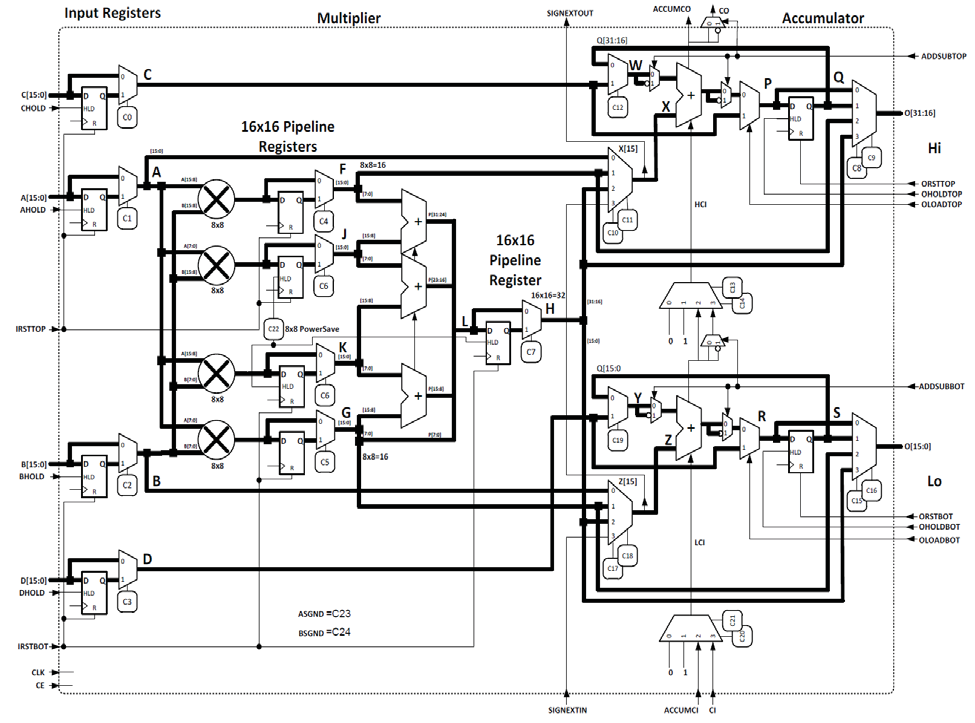

# UncertaintyPropogationEquation
A verilog source for a unit that applies the first-order uncertainty propogation equation to 16-bit inputs.

UPU: Uncertainty Propogation Unit

First-order uncertainty propogation equation:

$$\sigma_z^2 = \left({{\delta f}\over{\delta x}}\sigma_x\right)^2 + 2{{\delta f}\over{\delta x}}{{\delta f}\over{\delta y}}\sigma_{xy} + \left({{\delta f}\over{\delta y}}\sigma_y\right)^2$$

	var_x	 _______________________
	dfdx	 _______________	x16u____
		 	\_______x16s___/	|
		 	 \______		|
	covar_xy _______________x16s____	|
	dfdy	 _______________________x16s----+16s----+16s-----> var_z
		 	\_______			|
		 	 \______x16s____		|
	var_y	 _______________________x16u____________|

- The UPU verilog code makes use of multiple ice40 DSPs to carry out its addition and multiplication.
- The second term of the UPE requires a 3-operand multiply and a 1-bit shift to the right. This means 3 16-bit inputs will produce a 48-bit output. Is this desired?
- DSP functions are determined by the various input signals and control signals (for some reason yosys does not allow control signals to be non-constant).
- DSPs are capable of being pipelinedm, using the intermediate registers.

This is a basic version:
	/*
	 *	This design assumes the UPU to be a logic block
	 *	(in that it is treated just like an ALU - pure
	 *	combinational logic with no registers),
	 *	so all values will percolate asychronously.
	 *	Therefore all values will be non-registered.
	 *
	 *	The quantity of DSP blocks used have not been
	 *	considered.
	 */
