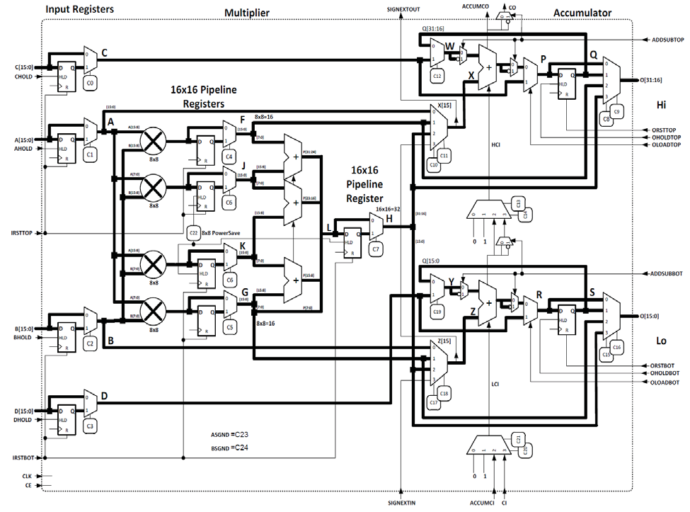
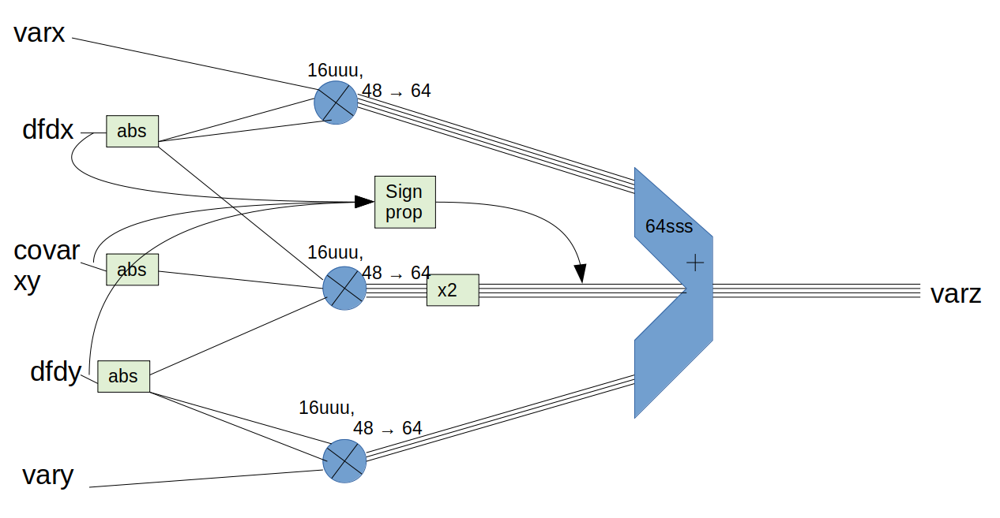

# UncertaintyPropogationEquation
A set of verilog source files for a unit that applies the first-order uncertainty propogation equation to 16-bit inputs.

This README is more or less a log of what I've done.

UPU: Uncertainty Propogation Unit

First-order uncertainty propogation equation:

The LaTex if you feel you need it:
$$\sigma_z^2 = \left({{\partial f}\over{\partial x}}\sigma_x\right)^2 + 2{{\partial f}\over{\partial x}}{{\partial f}\over{\partial y}}\sigma_{xy} + \left({{\partial f}\over{\partial y}}\sigma_y\right)^2$$

SB_MAC16 DSP Functional Model (Please replace with a higher resolution image if you find one):

This is a basic version I have made. Not very efficient, but helps to understand the data path involved and points of discussion that might come out of it.

This design assumes the UPU to be a logic block (in that it is treated just like an ALU - pure combinational logic with no registers), so all values will percolate asychronously. Therefore all values will be non-registered (see ice40 DSP control signals).
For easy multiplication, the absolute values of the inputs will be used and then the sign re-introduced at after multiplication.

Things to note:
- The UPU verilog code makes use of multiple ice40 DSPs to carry out its addition and multiplication.
- DSP functions are determined by the various input signals and control signals
- Each term of the UPE requires a 3-operand multiply (and the 2nd has a 1-bit shift to the right). This means 3 16-bit inputs will produce a 48-bit output. Is this desired?
- (As far as I know), the DSP cannot perform 2 independent 16-bit additions both with carry.
- The quantity of DSP blocks used have not been considered. I have used too many (~14 - the Ice40up5k only has 8).
- Any `probe` outputs were only used for testing. They can be removed.

# Discussion:
How many bits should the UPU work with?
Start off basic - use 16bit inputs because the DSP can only do 16x16 multiplication.
Due to triple multiplies, the UPU must add 48bit numbers together. This will output a 48bit number.
16bit input --> 48bit output...?

## Conserve number of bits
- Chop the 48bit down to 16bit. Which bits should be chopped? The lowest 32 bits? What if all the information is in the lowest 32 bits?
- Have a 64bit system, and reduce the input values to 16bit pre-UPU. But then how will it know where the fixed point is? Might as well use floating point? However floating-point representation is much more susceptible to instability. That was the reason for using integers in the first place.

## Don't conserve number of bits
- Ummm... okay...What should we do with the numbers then?

# Future exploration
- Extend to input 32bit integers?
- The ice40DSPs are capable of being pipelined, using the intermediate registers. This would result in a multi-stage execution with respect to a whole processor pipeline.
